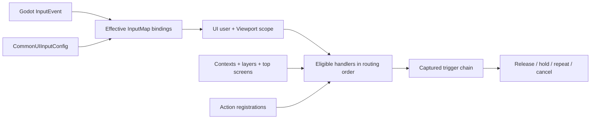

# How CommonUI works

[Back to the package README](../README.md)

CommonUI has one central rule: presentation code can describe *what is active*,
but only the native runtime decides *where an input goes*. That gives menus,
modals, and overlapping screens one deterministic routing order instead of a
collection of nodes competing in `_input()`.

## The mental model

Think of one input action as moving through three kinds of state:



The pieces have deliberately narrow ownership:

| Piece | Owns | Does not own |
|---|---|---|
| `CommonUIRuntime` autoload | Routing scopes, handler registration, captured triggers, device modality | Screen nodes or visual style |
| `CommonInputBindingRegistry` | Effective primary/secondary bindings, saved overrides, the addon's `InputMap` projection | Which screen currently handles an action |
| `CommonUILayer` | An ordered screen stack and its serialized mutation queue | Physical input bindings |
| `CommonActivatableScreen` | Its context handle, action handles, focus memory, activation state | Global routing policy |
| Widgets | Rendering snapshots and emitting UI signals | Authoritative runtime/binding state |

This separation explains two common surprises:

- Defining a binding does not create behavior. At least one eligible handler
  must register that logical action.
- Registering a handler does not invent a binding. The active config (or an
  existing `InputMap` entry) must let an `InputEvent` match the action.

## Startup and configuration

Enabling the editor plugin registers `CommonUI` as an autoload whose root node
is the native `CommonUIRuntime` class. The GDExtension also registers the native
resource and handle types (`CommonUIAction`, `CommonUIBinding`,
`CommonUIInputConfig`, and related classes).

The normal startup sequence is:

1. Godot loads the GDExtension and registers its native classes.
2. The `CommonUI` autoload enters the tree and begins observing the root
   viewport.
3. `CommonUIScreenRoot`, when used, creates and configures the `hud`, `menu`,
   `modal`, and `popup` layers.
4. If no config exists and `install_default_config` is enabled, the screen root
   calls `CommonUI.set_input_config(CommonUIDefaults.build_default_config())`.
5. The binding registry validates the config, copies its definitions into the
   effective set, projects `common_ui/...` actions into `InputMap`, loads saved
   overrides, and applies the modality/device policy.

An invalid config is rejected as one unit. The previous config, effective
bindings, and `InputMap` projection remain active instead of producing a mixed
old/new state.

## What happens to one input event

For the root viewport the autoload participates in Godot's input stages:

1. `_input()` observes device/modality only. It never consumes an event, so
   text input and ordinary `Control` navigation still get first chance.
2. After GUI handling, `_shortcut_input()` routes keyboard keys and joypad
   buttons.
3. `_unhandled_input()` routes mouse buttons, joypad axes, and touch. It skips
   keys/buttons to prevent double dispatch.
4. The runtime tests only actions that currently have registrations. Matching
   uses the registry's `InputMap` projection; modified key presses are exact,
   while releases are deliberately looser so releasing a modifier or centering
   an axis cannot strand a held trigger.
5. The physical device selects a UI user. Together with the viewport this forms
   the routing scope.
6. Eligible handlers for each matching logical action are sorted. The first
   logical action that any handler consumes wins when one physical event happens
   to match more than one action.
7. If consumed, the event is marked handled on the viewport it came from.

This ordering is why a key already consumed by a focused `Control` for a
built-in `ui_*` action may never reach CommonUI. It is also why CommonUI does not
break text fields merely by observing keyboard input.

## Routing scope and precedence

All native routing state is keyed by:

```text
(ui_user, Viewport)
```

Within that scope, candidates are ordered by these keys, highest precedence
first:

1. Active context priority; the most recently pushed context wins a tie.
2. Active layer priority; the earliest configured layer wins a tie.
3. A screen-scoped handler before a handler not scoped to a screen.
4. Handler `priority`; the most recently registered handler wins a tie.

An unscoped registration sorts after every context-scoped registration and
after every layer-scoped registration. Scoping is therefore useful for both
lifetime and priority, not just filtering.

Each active layer contributes its own top screen. A menu on the `menu` layer
does not automatically deactivate the HUD top on the `hud` layer: the menu's
handlers route first only when its context/layer ranks place them first, and a
lower layer can still handle an action the menu leaves unhandled. For a truly
exclusive modal, suspend the lower contexts (as `open_dialog()` does) and
consume the modal's handled actions.

A candidate is ineligible when any required part of its scope is unavailable:

- its owner was freed or the handle was released;
- its context is inactive or suspended;
- its layer is unknown or inactive;
- its screen is not in a layer or is not that layer's top screen; or
- an earlier `ROUTE_HANDLED` result already stopped this routing pass.

Use `CommonUI.get_last_route_report()` or the diagnostic overlay to see the
reason for every candidate considered by the most recent press.

### Route results

An action callback receives a `Dictionary` and must return one of these values
for `PHASE_PRESSED`:

| Result | Consumes the Godot event? | Continue to lower handlers? | Joins trigger chain? |
|---|---:|---:|---:|
| `ROUTE_UNHANDLED` | No | Yes | No |
| `ROUTE_HANDLED` | Yes | No | Yes |
| `ROUTE_HANDLED_CONTINUE` | Yes | Yes | Yes |

Returns for later phases are ignored. Still return a value from every branch so
the callback is clear and typed. A pressed callback returning `null` warns once
and is treated as `ROUTE_UNHANDLED`.

Callbacks are synchronous routing decisions. Emit a signal, enqueue a stack
request, or start longer work from the callback; do not `await` before returning
the route result.

## Trigger capture: why release goes back to the same handler

A consuming press captures the ordered chain of handlers that returned
`ROUTE_HANDLED` or `ROUTE_HANDLED_CONTINUE`. Later phases are delivered only to
still-eligible members of that chain:

```text
PRESSED -> HOLD_STARTED -> HOLD_REPEAT -> ... -> RELEASED
    \------------------------------------------> CANCELED
```

Important consequences:

- A release is never retargeted to a screen that opened after the press.
- OS key echo cannot restart the sequence. Hold/repeat cadence is owned by the
  runtime and comes from the action definition or registration override.
- Only one trigger for a given `(scope, action)` can be live. A second physical
  device pressing the same action does not rebuild the chain.
- If one chain member becomes ineligible, it receives `PHASE_CANCELED` and is
  removed. Remaining eligible members continue.
- The runtime-level `trigger_canceled` signal fires only when the whole captured
  trigger terminates abnormally, not on an ordinary release and not when only
  one member drops out.
- Window focus loss, a controller disconnect, viewport removal, explicit
  `cancel_action()`, and physical-state reconciliation can cancel a stranded
  trigger safely.

The handler payload contains:

| Key | Meaning |
|---|---|
| `action` | Logical `StringName` action id |
| `phase` | `CommonUIRuntime.PHASE_*` |
| `device` | Runtime-composed device id; use the decoded fields below in game code |
| `device_kind` | `DEVICE_KIND_KEYBOARD_MOUSE`, `DEVICE_KIND_JOYPAD`, `DEVICE_KIND_TOUCH`, or unknown |
| `device_index` | Raw platform index, `-1` if unavailable |
| `ui_user` | Routed UI user |
| `viewport_id` | Instance id of the routed viewport |
| `time_usec` | Monotonic event time |
| `repeat_index` | Zero-based repeat counter; meaningful for `PHASE_HOLD_REPEAT` |
| `handle_id` | Registration that received this call |

## Screen and stack lifecycle

`CommonUILayer` is more than a container. It runs every push, pop, replace, and
teardown as one serialized transaction.

For a successful push:

1. The destination is instantiated and validated before the stack changes.
2. The current top deactivates with `covered = true`. Its actions and context
   are removed, its focus is remembered, and its controls stop accepting focus;
   it remains visible behind the new screen.
3. The new screen is parented to the layer and enters `ACTIVATING`.
4. A modal suspends lower contexts and takes/traps focus immediately, before its
   intro transition, so input cannot leak through during the animation.
5. The layer awaits `_on_activating()`.
6. The screen pushes its own context, becomes `ACTIVE`, restores focus,
   registers automatic Back behavior if enabled, calls `_on_activated()`, and
   emits `activated`.
7. Only now does the native layer stack mark it as routing-active.

On pop, action handles and the context are released *before* the exit hook and
animation. The screen therefore cannot be activated twice by a second press
during fade-out. The layer then removes it, frees it unless
`keep_alive_when_popped` is true, reactivates the newly exposed top, and
restores the focus frame captured by the matching push.

If a screen is freed or reparented behind the layer's back, the layer prunes it
and serializes recovery behind any transaction already in flight. Prefer stack
methods, but accidental external removal does not leave a dangling top.

See [Screens and layers](screens-and-layers.md) for the APIs and patterns built
on this lifecycle.

## Handle ownership

`register_action()` and `push_context()` return reference-counted handles, but
dropping the GDScript reference does **not** unregister them.

- An action registration lives until `handle.release()` or until its owner
  object is freed.
- A context lives until `handle.release()`; it can be temporarily disabled with
  `set_suspended(true)` without losing its position.
- `CommonActivatableScreen` retains and releases the handles created through
  its `register_action()` helper.
- Releasing a handle is idempotent and safe during a dispatch. Runtime changes
  triggered by a callback are applied without invalidating the in-flight route.

Pass an explicit `owner` for raw runtime registrations when the callable does
not naturally carry one (for example, a static callable). Screen-level
registration sets the screen as owner automatically.

## Modality and glyph resolution

Input observation maintains one active modality: keyboard/mouse, gamepad, or
touch. The default policy filters controller-stick drift, requires enough mouse
motion to overcome jitter, and adds hysteresis so alternating devices do not
flicker the UI.

Glyph resolution has two distinct steps:

1. The runtime/registry resolves a logical glyph id for the requested action
   slot. For a recognized controller, a device profile checks
   `"<device_kind>:<code>"`; otherwise it uses the binding's `glyph_id`, then
   the profile fallback.
2. `InputGlyph` maps that logical id to a project-provided `Texture2D`. If the
   texture is absent, it renders a readable binding label or explicit text
   fallback and emits `glyph_missing` once for that missing state.

No artwork is bundled. The config describes logical identifiers, while the
game's theme/localization layer decides how they look.

## Root viewport, SubViewports, and UI users

The standard GDScript screen stack (`CommonUIScreenRoot`, `CommonUILayer`, and
automatic screen contexts) targets UI user 0 in the root viewport. This is the
complete, ready-to-use path for a normal single-player interface.

The native façade also accepts `ui_user` and `viewport` on raw registrations,
contexts, layers, screens, and snapshot queries. For a `SubViewport`, add one
`CommonUIViewportRouter` inside that viewport, then pass the same viewport to
*every* low-level state operation that belongs to it:

```gdscript
var p2_context: CommonUIContextHandle
var p2_action: CommonUIActionHandle


func set_up_player_two(
    sub_viewport: SubViewport,
    screen_owner: Control,
    joypad_device_index: int
) -> void:
    # InputEvent.device / Input.get_connected_joypads() uses this raw index.
    CommonUI.assign_device_to_user(joypad_device_index, 1)
    p2_context = CommonUI.push_context(&"p2_menu", 50, 1, sub_viewport)
    CommonUI.configure_layer(&"p2_menu", 50, true, 1, sub_viewport)
    CommonUI.push_screen(&"p2_menu", screen_owner, 1, sub_viewport)
    p2_action = CommonUI.register_action(
        &"common_ui/back",
        _on_p2_back,
        {
            "owner": self,
            "context": &"p2_menu",
            "layer": &"p2_menu",
            "screen": screen_owner,
            "ui_user": 1,
            "viewport": sub_viewport,
        }
    )


func _on_p2_back(event: Dictionary) -> int:
    if event["phase"] != CommonUIRuntime.PHASE_PRESSED:
        return CommonUIRuntime.ROUTE_UNHANDLED
    close_player_two_menu()
    return CommonUIRuntime.ROUTE_HANDLED
```

Device assignment uses the raw `InputEvent.device` index. It is not namespaced
by keyboard/mouse/gamepad kind. On a platform where the keyboard/mouse and first
controller both report index `0`, assigning that controller index also routes
those keyboard/mouse events to the same UI user. Use project-level device
filtering or distinct reported indices when that overlap is not acceptable.

Mixing a default-viewport context with a SubViewport registration makes the
registration permanently ineligible because they are different scopes. The
runtime warns when state is assigned to a non-default viewport with no live
router. Removing the router clears that viewport's scopes and cancels its live
triggers.

Retain and explicitly release the context/action handles when this custom scope
ends. Call `remove_screen()` too if the viewport remains alive; unregistering or
freeing the viewport router clears the complete viewport scope automatically.
Use `unassign_device(raw_index)` to return a device to the unassigned policy;
`get_user_for_device(raw_index)` reports its current target user.

This low-level model does not turn `CommonUILayer` into a per-user presentation
stack: those convenience classes currently hard-code user 0/default viewport.
Input modality, active-device name, and `resolve_glyph()` are runtime-global as
well, not per-user snapshots. Build a small project-specific wrapper if you need
split-screen stacks or independent per-player prompt artwork.

## Snapshot APIs

Diagnostics and presentation read immutable copies, so inspecting state cannot
change routing:

```gdscript
CommonUI.get_active_actions(ui_user, viewport)
CommonUI.get_active_contexts(ui_user, viewport)
CommonUI.get_captured_triggers(ui_user, viewport)
CommonUI.get_last_route_report()
CommonUI.has_active_trigger(action, ui_user, viewport)
```

Signals such as `active_actions_changed` and `context_changed` carry the UI user
but not the viewport. A multi-viewport integration should query the particular
viewport it owns after receiving a signal.

## Runtime signals and handle queries

The autoload emits:

| Signal | Arguments | Meaning |
|---|---|---|
| `active_actions_changed` | `ui_user` | Eligibility/presentation snapshot changed |
| `context_changed` | `ui_user` | A context was pushed, released, suspended, or resumed |
| `action_routed` | `action, consumed, ui_user` | A press finished routing |
| `trigger_canceled` | `action, ui_user` | A whole captured trigger ended abnormally |
| `input_modality_changed` | `modality, device` | Active modality or physical device changed |

An action handle supports `release()`, `is_active()`, `get_action()`,
`get_ui_user()`, and `get_handle_id()`. A context handle supports `release()`,
`is_active()`, `set_suspended(bool)`, `is_suspended()`, `get_context()`,
`get_ui_user()`, and `get_handle_id()`.

The API contract version is available as `CommonUIRuntime.get_api_version()`;
it is independent of the addon release version in `release_manifest.json`.
