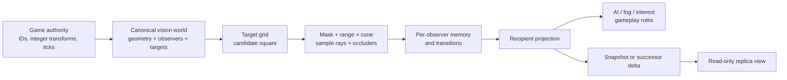

# How Common Vision works

Common Vision is a stateful visibility calculator, not a scene component. The
game owns canonical identities, converts positions to integers, decides when a
logical tick advances, and explicitly requests work. The addon copies those
values into an isolated native world and publishes a read model per observer.



There is no background `_process()` step. A projection changes only when
`query_observer()` or `advance()` completes that observer.

## The three kinds of state

### Canonical authority state

An `OFFLINE_AUTHORITY` or `SERVER_AUTHORITY` world stores:

- the complete occluder segment set;
- observer definitions;
- target definitions and a target spatial grid;
- each observer's private visibility memory;
- each observer's most recent completed projection.

Mutations are explicit and revision checked. Inputs are copied out of Godot
Dictionaries, so retaining or changing the Dictionary afterward has no effect
on the native world.

### Observer projection

A projection is the knowledge allowed for one observer after one complete
query. It contains visible records, permitted remembered records, and one-shot
expiry/removal records. It intentionally does not contain the canonical target
set.

The Godot methods return a Dictionary copy. Multiple consumers should share the
same `result_revision` rather than independently re-querying: AI, fog, UI, and
network encoding then agree on one authority result.

### Replica state

A `REPLICA` world never reconstructs canonical authority. It stores only the
latest validated projection packet for one observer and exposes it through
`get_replica_projection()`. It cannot register/query authority objects or
encode authority packets.

## Deterministic units

All canonical coordinates are signed 64-bit microunits. The package reports the
scale through `CommonVisionVersion.get_coordinate_scale()`:

```text
1 Godot world unit (by convention) = 1,000,000 Common Vision units
maximum coordinate magnitude       = 4,000,000,000,000 microunits
                                    = 4,000,000 world units
```

Positions, facing vectors, ranges, segment endpoints, and sample offsets use
integers. Geometry uses wide intermediate arithmetic for orientation, distance,
and query-bound calculations. No wall clock, floating-point transform, Node,
RID, resource instance, or allocation order becomes canonical state.

Determinism still requires the game to submit the same accepted inputs in the
same logical order. In particular:

- quantize transforms at one authoritative boundary;
- use stable positive IDs;
- use explicit monotonic ticks and revisions;
- do not derive authority IDs from runtime allocation;
- replicate the resulting projection instead of re-running authority from
  independently rounded client transforms.

Worlds are isolated. Two `CommonVisionWorld2D` instances may reuse observer and
target IDs without sharing state.

## Configuration and the target grid

`configure(world_id, role, spatial_cell_size, max_visited_cells)` replaces the
entire native world. The default cell size is `8_000_000` (eight conventional
world units); the maximum broadphase visit limit defaults to and cannot exceed
`65_536` cells.

Targets are indexed by their base position. For each observer, the broadphase
computes an axis-aligned square from `position ± range`, converts that rectangle
to grid cells, visits the cells in canonical order, and returns unique target
IDs sorted ascending. Observer registration and update validate the rectangle
before any buckets are visited. This prevents a tiny cell size plus a huge range
from creating unbounded empty-grid work.

Cell size is a tradeoff:

- smaller cells usually reduce false-positive target candidates but increase
  the number of visited cells;
- larger cells visit fewer buckets but may return more targets outside the
  actual circle/cone for exact filtering.

Sample offsets do not affect grid placement. A target whose base position is
outside the observer's broadphase, range, or cone cannot become visible because
an offset happens to be inside.

## One observer query, stage by stage

For candidate target IDs in ascending order, the native query performs:

1. **Candidate accounting.** Looking at a broadphase candidate costs one work
   unit, including candidates later rejected by a mask, range, or cone.
2. **Target-mask filter.** The target continues only if
   `target.mask & observer.target_mask != 0`.
3. **Exact range filter.** Squared distance from the observer to the target's
   base position must not exceed `range²`.
4. **Cone filter.** Unless `full_circle` is true (or the target is exactly at the
   observer position), the target must be in front of `facing` and meet the
   `cone_cos_million` half-angle threshold.
5. **Sample construction.** Each offset is added to the target base position
   with checked arithmetic. An out-of-range sum fails the whole query.
6. **Occlusion.** A ray from observer position to the sample is tested against
   every segment whose mask overlaps `observer.occluder_mask`. Each eligible
   segment test costs one work unit. Tests stop early when the sample is blocked.
7. **Sample policy.** `ANY_SAMPLE` stops at the first clear sample;
   `ALL_SAMPLES` stops at the first blocked sample.
8. **Memory transition.** The result is combined with only that observer's
   previously disclosed records.
9. **Atomic publication.** Memory, pending tombstones, completed tick, and
   result revision are committed only after the full query succeeds.

If any validation, arithmetic, role, tick, or work-limit check fails, the
observer retains its prior memory and latest projection. No partial projection
is published.

## Cones, masks, and samples

`facing` is a nonzero fixed vector, normally scaled to `1_000_000`. Its length
does not need to equal that scale because the cone calculation normalizes it
with integer lengths. The Godot facade substitutes `{1_000_000, 0}` when the
field is missing or exactly zero.

`cone_cos_million` is in `[0, 1_000_000]`:

| Value | Approximate total field of view |
| ---: | ---: |
| `1_000_000` | 0° (only exactly forward) |
| `923_880` | 45° |
| `866_025` | 60° |
| `707_107` | 90° |
| `500_000` | 120° |
| `0` | 180° open forward half-plane; exactly sideways is excluded |

Set `full_circle: true` for 360°. A value of zero is not a substitute for full
circle: every noncoincident target still needs a strictly positive facing dot
product, so points exactly sideways or behind the facing vector fail.

Masks are unsigned 32-bit, nonzero bit fields. A target mask is compared with
the observer target mask. A segment mask is separately compared with the
observer occluder mask. They are selection layers, not collision objects or
Godot physics layers, though a game may deliberately use the same bit plan.

A target has one to eight sample offsets. Missing or empty `sample_offsets`
becomes one center sample `{0, 0}`. Use a few meaningful points—for example,
torso and head—rather than outlining a sprite. Every extra sample can multiply
occlusion work.

## Exact occlusion geometry

Occluder geometry is a complete, revisioned set of nonzero two-sided segments.
The set is sorted by segment ID when accepted, making early blocker order
canonical even if the input Array was ordered differently.

Algorithm contract 1 uses these line-of-sight rules:

- a proper crossing blocks;
- a positive-length collinear overlap blocks;
- a target sample lying on a segment blocks, except when it coincides with the
  observer origin and the sight ray has zero length;
- touching only an isolated occluder endpoint is clear;
- merely starting on a segment is clear, allowing an observer to see out of a
  wall containing its origin;
- traveling along that wall for positive length still blocks;
- one-sided segments are unsupported and rejected.

The runtime does not derive walls from TileMaps, polygons, physics bodies, or
navigation meshes. Convert authored geometry to canonical segment dictionaries
in game/tooling code, remove shared internal edges, assign stable IDs, and submit
the complete set with `set_occluder_segments()`.

Occluders are currently stored as one sorted list rather than a spatial index.
After a target passes the coarse filters, each sample can test every
mask-eligible segment. Geometry size is therefore a primary work-budget input.

## Visibility memory and privacy

States are:

- `VISIBLE (2)`: confirmed by the current completed query;
- `REMEMBERED (1)`: previously visible and still within `memory_ticks`;
- `UNKNOWN (0)`: no current permitted knowledge.

Never-seen targets do not get records. A target rejected by masks, range, cone,
or occlusion cannot leak its ID, revision, or even its contribution to the
projection's record count.

Once visible, a record stores `first_seen_tick`, `last_seen_tick`, the current
position, the current target revision, and the geometry revision used by the
query. When it becomes hidden:

- if `memory_ticks > 0`, it becomes `REMEMBERED` and retains the last visible
  position and last disclosed target revision;
- if `memory_ticks == 0`, one `MEMORY_EXPIRED` record is emitted with no valid
  position and the record is then purged;
- otherwise memory expires when
  `current_tick - last_seen_tick > memory_ticks`, not when it is equal.

An expired target emits `MEMORY_EXPIRED` once and is absent from the following
projection. Removing a target for which the observer still retains a disclosed
visible/remembered record similarly emits one position-free `REMOVED`
tombstone. Removal after that memory was purged—or removal of a never-disclosed
target—emits nothing. Records and tombstones are sorted by target ID.

This privacy model is preserved by packet encoding because callers can encode
only the native world's latest completed observer projection. There is no API
that accepts an arbitrary caller-authored projection for encoding.

## Ticks and four different revisions

Common Vision uses several counters with intentionally different meanings:

| Counter | Owner | Rule | Purpose |
| --- | --- | --- | --- |
| authority tick | game | nonnegative; never regress per observer | memory time and completed-result label |
| geometry revision | game | positive and strictly increases per replacement | reject stale whole-geometry writes |
| observer/target revision | game | registration positive; update must be exactly expected + 1 | compare-and-swap definition updates |
| world revision | addon | starts at 1; increments on each accepted canonical mutation | identifies canonical state captured by a projection |
| result revision | addon, per observer | starts at 1; increments on every successful query | projection identity and wire sequence |

Ticks may skip and may be equal to the previous completed tick; they are not
required to advance by one. A lower tick is rejected. For clear memory and game
loop semantics, monotonically increase the authority tick once per simulation
step and query an observer at most once for that step.

Result revision increases even when visible content did not change. Snapshot
and delta sequencing follows result revisions, not ticks, world revisions, or
target revisions.

## Scheduled queries and work units

`advance(tick, work_budget)` considers all observers in this deterministic
order:

1. `urgent == true` before non-urgent;
2. older `last_completed_tick` first;
3. higher numeric `priority` first;
4. lower observer ID first.

Before running an observer, the scheduler computes a conservative estimate:

```text
broadphase candidate count
+ sum(sample count × total geometry count) for target-mask candidates
```

The estimate is capped at the compiled per-tick work maximum. It deliberately
does not assume that range, cone, occluder masks, or an early blocker will make
the real query cheaper. If the estimate does not fit the remaining requested
budget, that whole observer is deferred; the scheduler may still run a later,
cheaper observer. Actual consumed work can be lower than requested work.

One work unit is exactly:

- one broadphase candidate evaluation; or
- one mask-eligible occluder intersection test.

The scheduler never publishes a partial observer. `get_projection()` continues
to return its last successful result, so consumers must inspect
`completed_tick`. Direct `query_observer()` uses the compiled maximum allowance
of `10_000_000` work units. `advance()` rejects a requested budget above that
same maximum.

Publication is atomic per observer, not across the entire `advance()` call. If a
later observer fails—for example, because it was queried directly at a newer
tick or a position-plus-sample sum is out of range—observers earlier in scheduler
order may already have published before `advance()` returns a failure. Use one
global nondecreasing authority tick, never schedule below an observer's last
completed tick, and reject invalid sample sums at your authoring boundary.

The returned `invalidated` metric is reserved by the current API; this
implementation has no public mid-query invalidation source and leaves it at
zero.

## What “server-authoritative” does and does not mean

The role gate prevents a `REPLICA` node from invoking canonical authority
operations. It does not decide which process is the server, authenticate an
RPC, encrypt packets, authorize observer ownership, or stop your game from
sending a recipient's bytes to the wrong peer.

The game must:

- keep complete geometry/target state on a trusted authority;
- map authenticated peers to allowed observer IDs;
- encode each observer's already-redacted projection;
- deliver bytes over a bounded, authenticated transport;
- apply bytes only to the corresponding replica world;
- request and deliver newer snapshots after a sequence gap.

See [Authority and replicas](networking.md) for the complete packet lifecycle.
