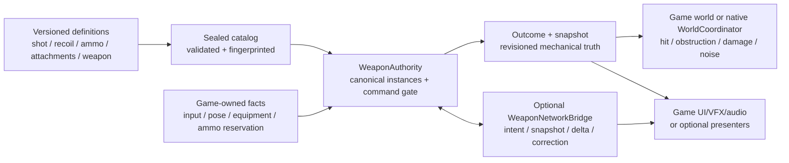

# How Weapon System Works

This is the practical, start-here guide to the shipped Weapon System addon.
It describes the public Godot surface as it exists today: how content becomes
an immutable catalog, how `WeaponAuthority` owns live weapon state, how fire,
reload, recoil, and attachment commands change that state, and where your game
must take over for world resolution, networking, inventory, and presentation.

Weapon System is not a ready-made gun scene. It is a deterministic mechanical
authority. You supply input, actor/world facts, ammunition reservations, and
visuals; it decides whether a weapon command is legal and produces revisioned
state plus a committed-shot value.

## Mental model



The ownership split is intentional:

| Weapon System owns | Your game owns |
|---|---|
| Definition validation and content fingerprinting | Which actor owns/equips a weapon |
| Loaded-round count and exact loaded ammo-profile identity | Physical ammunition storage and reservations |
| Ready/reloading phase, cadence, revision, recoil anchor, attachment loadout | Input, animation, audio, VFX, crosshair, and HUD |
| Command admission, idempotent outcomes, deterministic spread and recoil | Authoritative actor pose and target eligibility |
| Transport-neutral protocol values and an optional Godot multiplayer bridge | Peer creation, authentication, lobby/session identity, and transport topology |
| An engine-free C++ 2D hitscan world coordinator | Godot-facing raycasts today, plus armor and penetration policy |

## First working weapon: direct/offline authority

This is the shortest complete runtime path. It uses the Dictionary catalog
surface because that is the only catalog surface currently connected to
`WeaponAuthority`.

```gdscript
extends Node

const INSTANCE_ID := "player-1:primary"

var weapon_authority: WeaponAuthority
var authority_tick := 10
var next_sequence := 1


func _ready() -> void:
    if not ClassDB.class_exists(&"WeaponAuthority"):
        push_error("Weapon System's native GDExtension did not load")
        return

    weapon_authority = WeaponAuthority.new()
    add_child(weapon_authority)
    weapon_authority.shot_committed.connect(_on_shot_committed)

    var configured := weapon_authority.configure(
        [
            {
                "id": "demo-shot",
                "version": 1,
                "damage_milliunits": 34_000,
                "range_milliunits": 8_000,
                "spread_microradians": 0,
                "aim_tolerance_microradians": 200_000,
                "origin_tolerance_milliunits": 750,
            },
        ],
        [
            {
                "id": "demo-pistol",
                "version": 1,
                "shot_profile_id": "demo-shot",
                "shot_profile_version": 1,
                "ammunition_trait": "ammo.demo-9mm",
                "capacity": 12,
                "cadence_ticks": 8,
                "reload_ticks": 45,
                "noise_radius_milliunits": 12_000,
                "accuracy_moa_milli": 2_500,
                "recoil_profile_id": "demo-recoil",
                "recoil_profile_version": 1,
            },
        ],
        [
            {
                "id": "demo-recoil",
                "version": 1,
                "vertical_kick_nrad": 4_000_000,
                "horizontal_kick_min_nrad": -1_500_000,
                "horizontal_kick_max_nrad": 1_500_000,
                "recovery_per_tick_nrad": 500_000,
                "max_vertical_offset_nrad": 20_000_000,
                "max_horizontal_offset_nrad": 8_000_000,
            },
        ],
        [], # Attachment definitions.
        [
            {
                "id": "demo-9mm-fmj",
                "version": 1,
                "ammunition_trait": "ammo.demo-9mm",
            },
        ]
    )
    assert(bool(configured.get("ok", false)), str(configured))

    var created := weapon_authority.create_weapon(
        INSTANCE_ID,
        "demo-pistol",
        1,
        3,
        {"id": "demo-9mm-fmj", "version": 1}
    )
    assert(bool(created.get("ok", false)), str(created))

    fire_once({"x": 0, "y": 0}, {"x": 1_000_000, "y": 0})


func fire_once(origin: Dictionary, aim: Dictionary) -> void:
    var state := weapon_authority.snapshot(INSTANCE_ID)
    var outcome := weapon_authority.fire({
        "command_id": "fire-%d" % next_sequence,
        "sequence": next_sequence,
        "instance_id": INSTANCE_ID,
        "expected_revision": int(state["revision"]),
        "tick": authority_tick,
        "claimed_origin": origin,
        "claimed_aim": aim,
        "spread_seed": 7,
    }, {
        "actor_live": true,
        "weapon_equipped": true,
        "weapon_usable": true,
        "authoritative_origin": origin,
        "authoritative_aim": aim,
    })
    next_sequence += 1

    if not bool(outcome.get("accepted", false)):
        push_warning("Fire rejected: %s" % str(outcome))


func _on_shot_committed(outcome: Dictionary) -> void:
    # Exact retries return accepted=true and replayed=true. Do not dispatch
    # non-idempotent world consequences twice.
    if bool(outcome.get("replayed", false)):
        return
    var shot: Dictionary = outcome["shot"]
    print("Committed direction: ", shot["direction"])
    # Resolve the ray against your game world here; see "After fire commits".
```

The catalog values and call shapes above mirror the repository's executable
headless authority probe. The important sequence is:

1. Configure and seal content.
2. Create a uniquely named instance. Its initial revision is `0`.
3. Read the current snapshot before constructing a command.
4. Mint a unique command ID and a strictly increasing per-instance sequence.
5. Supply the current revision and a non-regressing authority tick.
6. Supply server-owned facts separately from player claims.
7. Use the returned outcome as the immediate receipt, then resolve an accepted
   committed shot in game-owned world code.

`WeaponAuthority.ROLE_OFFLINE_AUTHORITY` is the default. Setting
`ROLE_SERVER_AUTHORITY` only labels the node; the behavioral client/server
split is implemented by `WeaponNetworkBridge`.

## Definitions and catalogs

Five versioned definition kinds feed the runtime:

| Definition | What it controls |
|---|---|
| Hitscan shot profile | Damage, range, claim tolerances, and one legacy spread field |
| Recoil profile | Per-shot vertical/horizontal kick, linear recovery per tick, and accumulated caps |
| Ammunition ballistic profile | An exact `(id, version)` plus the ammunition trait it satisfies |
| Attachment definition | Compatible slot-kind mask/tags and accuracy, recoil, noise, reload-duration, and cadence modifiers |
| Weapon definition | Profile references, ammo trait, capacity, cadence, reload duration, noise, milli-MOA accuracy, and flat slots |

`WeaponAttachmentSlotResource` is a nested authoring value used by a weapon
definition, not a sixth independently registered definition kind.

All references are exact `(id, version)` references. There is no implicit
"latest version" lookup. Sealing validates cross-references and calculates a
deterministic fingerprint. Later changes to the original Dictionaries or
Resources do not mutate the sealed native copy.

### Two authoring surfaces that do not connect automatically

The addon exposes two separate catalog owners:

- `WeaponDefinitionCatalog` accepts the six editor-friendly Resource classes.
  Use `validate_catalog(...)`, `register_*()`, and `seal()` for authoring/CI
  validation, counts, and a fingerprint.
- `WeaponAuthority.configure(...)` accepts five Dictionary arrays, seals its
  own catalog, and constructs the live runtime.

There is currently no `configure_from_catalog()` and no public method that
extracts definitions from a sealed `WeaponDefinitionCatalog`. A Resource
catalog cannot be handed to `WeaponAuthority`. A game that authors `.tres`
files must presently keep a game-owned conversion/loading layer, repeat the
same values as runtime Dictionaries, or provide native glue.

Treat `WeaponAuthority.configure()` as startup configuration. A
successful call replaces both its prior catalog and runtime, which discards
all live instances. A failed call leaves the previous catalog/runtime intact.

For every field and the fixed-point MOA/modifier formulas, see
[`authoring.md`](authoring.md).

### Implemented firearm shape

The shipped runtime supports semi-automatic 2D hitscan, deterministic spread,
recoil/recovery, internal loaded rounds, simple timed reloads, exact ammo
profile identity, and flat attachment loadouts. It does not implement
automatic/burst fire, projectiles, chamber state, detachable magazine item
instances, tactical reload policy, heat, durability, jams, armor,
penetration, body parts, or medical consequences.

Unsupported `mechanism` or `fire_mode` Resource values are visible in the
Inspector vocabulary but fail catalog validation; they are not approximated.

## `WeaponAuthority`: the live state owner

One `WeaponAuthority` can own many weapon instances. Every instance is a
revisioned value containing:

| State group | Snapshot fields |
|---|---|
| Identity | `instance_id`, `definition_id`, `definition_version` |
| Mechanical version | `revision`, `phase` (`"ready"` or `"reloading"`) |
| Ammunition | `loaded_rounds`, `loaded_profile` |
| Cadence | `has_last_fire_tick`, `last_fire_tick` |
| Reload | `reload` with reservation/profile/start/due fields, or `{}` |
| Recoil anchor | `recoil_vertical_offset_nrad`, `recoil_horizontal_offset_nrad`, `recoil_anchor_tick` |
| Attachments | Canonically slot-sorted `attachment_loadout` |
| Command baseline | `has_last_command_sequence`, `last_command_sequence`, `admitted_sequence_high_watermark` |
| Authority boundary | `authority_scope`, `authority_epoch`, `authority_tick_floor`, `tick_unhealthy` |

`snapshot(instance_id)` returns `{}` when the instance is absent;
`snapshots()` returns all live snapshots. `loaded_profile(instance_id)` always
returns `{has_profile, id, version}`; only trust `id` and `version` when
`has_profile` is true.

### Creating and removing instances

`create_weapon(...)` takes `instance_id`, `definition_id`,
`definition_version`, `loaded_rounds`, `profile`, `authority_scope`, and
`authority_epoch`, and creates revision
`0` state. When `loaded_rounds > 0`, `profile` is required and its sealed ammo
trait must match the weapon. When `loaded_rounds == 0`, the profile must be an
empty Dictionary.

There are two removal paths:

- `remove_weapon(instance_id)` is an administrative immediate removal. It
  bypasses the command gate, leaves no tombstone, and returns any active
  `reservation_to_release`.
- `teardown(command)` is the revisioned, idempotent authority path. It uses
  the normal command envelope, advances the successor revision, releases an
  active reload reservation in its outcome, removes live state, and retains a
  bounded tombstone queryable through `tombstone(instance_id)`.

Use `teardown()` when peers or persistence need to distinguish "destroyed"
from "never existed". After server teardown, call
`WeaponNetworkBridge.replicate_teardown(instance_id)` for relevant peers.

`replace_snapshots(array)` is a trusted wholesale recovery/restore operation,
not a client update API. On success it replaces the complete live instance set
and emits `state_corrected`.

## Commands, ticks, revisions, and receipts

Every mutating direct-authority command carries the same envelope:

| Key | Rule |
|---|---|
| `command_id` | Stable idempotency key, at most 128 bytes. It must be globally unique within one authority/runtime; reuse it only for an exact retry. |
| `sequence` | Strictly increases for that scope/instance/epoch. Start at `1`. |
| `instance_id` | Existing live instance targeted by the command. |
| `expected_revision` | Must equal the current snapshot revision. |
| `tick` | Trusted, game-owned authority tick; it may stay equal but must not regress. |
| `authority_scope` | Must equal the scope used at instance creation; defaults to `""`. |
| `authority_epoch` | Must equal the trusted instance epoch; defaults to `0`. |

The runtime does not derive the authority tick from `_process()` or physics.
Your authoritative game loop owns it. Cadence, reload deadlines, and recoil
recovery are measured in these integer ticks, so use one stable tick rate and
advance it monotonically.

An accepted mutation advances the instance revision once. A gameplay
rejection does not change mechanical state, but an admitted rejection does
advance command-admission bookkeeping so the same sequence cannot later be
repurposed.

### Immediate outcome (the command receipt)

`fire()`, `begin_reload()`, `cancel_reload()`,
`configure_attachments()`, and `teardown()` synchronously return:

```text
{
  accepted: bool,
  replayed: bool,
  rejection: int,
  status: { ok: bool, code: int, diagnostic: int, detail: int },
  revision: int,
  loaded_rounds: int,
  reservation_to_release: String,
  shot: Dictionary
}
```

There is no public Godot class named `Receipt`; this `CommandOutcome`
Dictionary is the direct-call receipt. Setup/lifecycle calls such as
`configure()` and `create_weapon()` use top-level `ok` instead of `accepted`.

An exact retry of the same `command_id` and canonical payload returns the
recorded outcome with `replayed: true` and does not mutate state again. Reusing
the ID with a different payload returns a duplicate conflict. Old sequences
whose cached receipts have aged out remain non-executable.

Important: `WeaponAuthority` chooses its signal branch from `accepted`, so an
accepted replay can emit `shot_committed`, `reload_started`,
`reload_cancelled`, `attachment_loadout_changed`, or `instance_torn_down`
again. Consumers that perform side effects must inspect `replayed` or dedupe
by their own command/consequence identity.

Façade/readiness conversion failures can return before a core command is
submitted and therefore need not emit `command_rejected`. Always handle the
synchronous return value; signals are not a replacement for it.

## What happens when fire is submitted

`fire(command, authority_context)` keeps the untrusted claim and trusted facts
separate. The `authority_context` Dictionary has these keys:

| Key | Default | Meaning |
|---|---:|---|
| `actor_live` | `false` | Authority says the actor can act. |
| `weapon_equipped` | `false` | Authority says this instance is equipped. |
| `weapon_usable` | `false` | Authority says it is currently usable. |
| `authoritative_origin` | `{x:0,y:0}` | Trusted origin in world milliunits. |
| `authoritative_aim` | `{x:0,y:0}` | Trusted fixed unit direction, scale `1_000_000`. Must be nonzero. |
| `spread_modifier_ppm` | `1_000_000` | Accuracy/spread multiplier; current folded range is 500,000–1,500,000. |
| `damage_modifier_ppm` | `1_000_000` | Direct damage multiplier; structural range is 0–4,000,000. |
| `range_modifier_ppm` | `1_000_000` | Direct range multiplier; structural range is 0–4,000,000. Keep the result within world-coordinate limits. |
| `noise_modifier_ppm` | `1_000_000` | Noise-radius multiplier; current folded range is 500,000–1,500,000. |
| `recoil_modifier_ppm` | `1_000_000` | New-kick multiplier; current folded range is 500,000–1,500,000. |

The direct fire path performs, conceptually, these steps:

1. Validate the command envelope and fixed-point values.
2. Check expected revision, liveness, equipment, usability, and ready phase.
3. Compare claimed origin/aim against the trusted pose using sealed
   tolerances. The claim is never used as the committed pose.
4. Check attachment-adjusted cadence and loaded ammunition/profile validity.
5. Fold weapon accuracy, attachment deltas, and the authority spread modifier;
   sample deterministic dispersion from the seed, sequence, and instance ID.
6. Derive residual recoil at this tick. Residual recoil affects this shot's
   direction; the newly sampled kick becomes the anchor for later shots.
7. Fold damage/range/noise values and build the committed shot from the
   authoritative origin and aim.
8. Consume exactly one round, clear `loaded_profile` if it was the last round,
   advance revision once, and record the receipt.
9. Emit `shot_committed` and `recoil_anchor_changed` through the Godot façade.

### The public GDScript committed-shot value

On an accepted direct fire, `outcome.shot` contains:

| Key | Meaning |
|---|---|
| `consequence_id` | Legacy compact string, currently `command_id + ":shot"`. Useful as a GDScript dedupe key. |
| `instance_id` | Source weapon instance. |
| `weapon_id`, `weapon_version` | Exact weapon definition. |
| `tick` | Trusted tick used for the commit. |
| `origin` | Trusted `{x,y}` origin. |
| `direction` | Deterministic `{x,y}` fixed unit direction (scale `1_000_000`). |
| `damage_milliunits` | Authority-scaled damage magnitude. |
| `range_milliunits` | Authority-scaled range. |
| `noise_radius_milliunits` | Attachment/authority-scaled noise radius. |
| `consumed_profile` | `{has_profile:true,id,version}` of the round consumed. |

The core `CommittedShot` also contains an exact shot-profile identity and a
structured `ConsequenceIdentity`, but `WeaponAuthority`'s current Dictionary
conversion does not expose those fields. Do not claim they are available to
GDScript from `shot_committed`; use `consequence_id` for the current façade or
native C++ access when the full value is required.

## After fire commits: hits, damage, noise, and ballistics

`shot_committed` means the mechanical transaction succeeded. It does **not**
mean that a target was hit. `WeaponAuthority` does not raycast, select a target,
apply damage, publish noise, or emit `shot_resolved`.

For a GDScript game today:

1. Receive a non-replayed committed shot.
2. Convert its fixed origin/direction/range into your world units.
3. Query your authoritative physics/world state.
4. Apply your deterministic obstruction/target tie rules.
5. Dispatch damage through exactly one game-owned damage authority.
6. Publish positional noise even on a resolved miss or obstruction.
7. Make damage/noise handling idempotent using `consequence_id`.

The addon does implement `wpn::WorldCoordinator` in engine-free C++. Native
consumers can supply pose, eligible-target, obstruction, damage, and noise
ports. It selects the nearest target/obstruction, lets obstruction win an
equal-distance tie, lets the lower stable target ID win equal target ties,
dispatches at most one damage request, and retains bounded unresolved
consequences after query/ambiguous-sink faults. It is not registered with
Godot `ClassDB`, so there is no `WeaponWorldCoordinator` Node or GDScript API.

Despite its name, `AmmunitionBallisticProfile` currently carries only an
identity/version and matching ammunition trait. The identity follows loaded
rounds, reservations, committed shots, and native damage requests. Projectile
flight, penetration, armor response, and bullet-specific behavior remain
game-owned.

## Recoil

Recoil is stored as an anchor, not mutated every tick. An accepted shot first
derives residual vertical/horizontal offsets at the fire tick using linear
`recovery_per_tick_nrad`, adds that residual to the shot direction, then adds
the newly sampled kick and stores a new anchor at the same tick.

Use:

```gdscript
func read_recoil() -> void:
    var recoil := weapon_authority.effective_recoil(INSTANCE_ID, authority_tick)
    if recoil.get("ok", false):
        var vertical_nrad := int(recoil["vertical_offset_nrad"])
        var horizontal_nrad := int(recoil["horizontal_offset_nrad"])
```

This query is read-only. There is deliberately no per-tick recoil-recovery
signal. Attachment and direct authority modifiers affect the new kick only;
they do not change the sealed recovery slope.

## Attachments

A weapon definition declares at most eight flat slots. Each slot has a stable
ID and exactly one kind: optic, muzzle, stock, or grip. An attachment definition
declares a compatible slot-kind bitmask. Runtime compatibility currently uses
that kind mask; `compatible_tags` are authored/fingerprinted metadata but are
not checked by `configure_attachments()`.

`configure_attachments()` replaces the complete loadout atomically. It is not
a patch. Omit a slot to leave it empty:

```gdscript
func equip_demo_optic() -> void:
    var state := weapon_authority.snapshot(INSTANCE_ID)
    var outcome := weapon_authority.configure_attachments({
        "command_id": "attachments-2",
        "sequence": next_sequence,
        "instance_id": INSTANCE_ID,
        "expected_revision": int(state["revision"]),
        "tick": authority_tick,
        "desired_loadout": [{
            "slot_id": "optic",
            "attachment_id": "demo-red-dot",
            "attachment_version": 1,
        }],
    })
    next_sequence += 1
```

The complete command is rejected if any slot is unknown/duplicated, any exact
attachment reference is missing, the kind is incompatible, or the weapon is
reloading. On acceptance, the loadout is stored in canonical slot-ID order and
revision advances once.

Attachment deltas are signed parts-per-million changes around `1_000_000`.
For example, `accuracy_modifier_ppm = -100_000` contributes a 10% reduction.
All contributions are sorted, summed, and clamped once, so result order does
not depend on submission order. `effective_modifiers(instance_id)` returns
the current attachment-only multipliers; it does not include one fire call's
authority-supplied modifiers.

## Reload

Reload is deliberately split across Weapon System and an external ammunition
owner. Weapon System never invents, removes, or refunds inventory ammunition.

The direct flow is:

1. Your inventory/game authority reserves a positive number of rounds under a
   stable reservation ID and determines their exact ballistic profile.
2. Submit `begin_reload()` with that reservation, amount, and profile.
3. On acceptance, the instance enters `reloading`, revision advances, and the
   snapshot records `start_tick` and attachment-adjusted `due_tick`.
4. Drive authority ticks. `advance_tick(tick)` commits all reloads due at or
   before that tick, adds at most the missing capacity, advances revision, and
   emits `reload_completed`.
5. Finalize the external reservation according to the completion. If begin is
   rejected, release the reservation yourself.

```gdscript
func reload_demo_weapon() -> void:
    var state := weapon_authority.snapshot(INSTANCE_ID)
    var begun := weapon_authority.begin_reload({
        "command_id": "reload-3",
        "sequence": next_sequence,
        "instance_id": INSTANCE_ID,
        "expected_revision": int(state["revision"]),
        "tick": authority_tick,
        "reservation_id": "inventory-reservation-42",
        "reserved_rounds": 9,
        "profile": {"id": "demo-9mm-fmj", "version": 1},
    })
    next_sequence += 1

    if begun.get("accepted", false):
        var reload_state: Dictionary = weapon_authority.snapshot(INSTANCE_ID)["reload"]
        authority_tick = int(reload_state["due_tick"])
        var completions := weapon_authority.advance_tick(authority_tick)
        for completion: Dictionary in completions:
            print("Reload added ", completion["added_rounds"], " rounds")
    else:
        # Tell your ammo owner to release inventory-reservation-42.
        pass
```

A non-empty weapon can only be topped up with the same exact profile already
loaded. `cancel_reload()` returns the accepted reservation ID in
`reservation_to_release`; `teardown()` and administrative `remove_weapon()`
do the same when they interrupt an active reload.

For a cross-system coordinator, `due_reloads(tick)` previews due completions
without mutation. After the other participant is ready,
`commit_due_reload(tick, instance_id, reservation_id)` commits one. That split
method does not emit `reload_completed`; call
`publish_reload_completion(completion)` after the entire transaction has been
accepted. `due_reloads()` and `advance_tick()` both return `[]` for "none due"
and for not-ready/error cases, so validate setup and keep ticks monotonic.

## Snapshots, corrections, and signals

Snapshots are canonical state, not UI models. Read them after every accepted
command rather than trying to reconstruct state from signals alone.

`WeaponAuthority` emits:

| Signal | Payload and use |
|---|---|
| `shot_committed(outcome)` | Accepted fire receipt; may be replayed. World resolution still belongs to the game. |
| `recoil_anchor_changed(anchor)` | `{instance_id, revision, vertical_offset_nrad, horizontal_offset_nrad, anchor_tick}` after accepted fire. |
| `reload_started(outcome)` | Accepted begin-reload receipt. |
| `reload_completed(completion)` | Published completion with instance/reservation/added rounds/revision/profile. |
| `reload_cancelled(outcome)` | Accepted cancellation receipt and reservation to release. |
| `attachment_loadout_changed(dto)` | Accepted canonical loadout plus instance/revision. |
| `instance_torn_down(outcome)` | Accepted revisioned teardown. |
| `command_rejected(outcome)` | A core command rejection; some earlier façade failures only return. |
| `state_corrected(snapshots)` | Successful trusted `replace_snapshots()`. |

The outcome used by `command_rejected` does not contain `instance_id` for
non-fire commands. A multi-instance caller should correlate the synchronous
return with the command it just submitted instead of relying on that signal
alone.

## Networked use

`WeaponNetworkBridge` is optional transport plumbing. The game still owns and
installs the branch's `MultiplayerPeer`; the bridge never creates a server,
connects a client, authenticates a player, or decides ownership.

### Server wiring

Create and configure a `WeaponAuthority` first, then add a server bridge:

```gdscript
var bridge: WeaponNetworkBridge

func _ready() -> void:
    bridge = WeaponNetworkBridge.new()
    bridge.name = "WeaponBridge" # Same node path must exist on both peers.
    bridge.role = WeaponNetworkBridge.ROLE_SERVER
    bridge.weapon_authority_path = NodePath("../WeaponAuthority")
    bridge.authority_scope = "match-17"
    bridge.authority_epoch = 1
    bridge.authority_context_provider = Callable(self, "_weapon_context")
    bridge.reload_profile_provider = Callable(self, "_reload_profile")
    add_child(bridge)

func _weapon_context(context: Dictionary) -> Dictionary:
    # Look up these facts from the authenticated peer/session/instance.
    return {
        "actor_live": true,
        "weapon_equipped": true,
        "weapon_usable": true,
        "authoritative_origin": {"x": 0, "y": 0},
        "authoritative_aim": {"x": 1_000_000, "y": 0},
    }

func _reload_profile(context: Dictionary) -> Dictionary:
    # Validate context.reservation_id/reserved_rounds in your ammo authority.
    return {"id": "demo-9mm-fmj", "version": 1}
```

The instance must have been created with the same `authority_scope` and
`authority_epoch`. The authority-context callback currently receives
`peer`, `session`, `instance_id`, `command_id`, and `sequence`. The reload
callback receives those plus `reservation_id` and `reserved_rounds`.

After your game authenticates a connection:

```gdscript
func admit_weapon_peer(peer_id: int, game_session_id: int) -> void:
    bridge.begin_session(peer_id, game_session_id)
    bridge.authorize_instance(peer_id, INSTANCE_ID, 1) # 0 observer, 1 owner.
```

Call `end_session(peer_id)` on session end. Use `drop_peer(peer_id)` when the
connection and all retained ownership/rate/acknowledgement state should be
forgotten. Neither call clears the bridge's per-instance command-sequence
tracker or `WeaponAuthority`'s idempotency history. Authorization also makes
the peer replication-relevant and sends its first full snapshot.

Drive both pieces from the authoritative tick loop:

```gdscript
func run_weapon_tick(tick: int) -> void:
    weapon_authority.advance_tick(tick) # Completes due reload mechanics.
    bridge.push_state(tick)             # Advances bridge time and catches peers up.
```

`push_state()` is the server bridge's source of trusted command time as well
as a catch-up sweep. Accepted fire/reload/cancel/attachment requests push
state immediately, but reload completion happens outside those RPC handlers;
the periodic push is what makes that later state converge.

### Client wiring and command submission

Create a client bridge at the same multiplayer-relative node path:

```gdscript
var bridge: WeaponNetworkBridge

func _ready() -> void:
    bridge = WeaponNetworkBridge.new()
    bridge.name = "WeaponBridge"
    bridge.role = WeaponNetworkBridge.ROLE_CLIENT
    bridge.server_peer_id = 1
    add_child(bridge)
    bridge.presentation_predicted.connect(_on_weapon_predicted)
    bridge.presentation_confirmed.connect(_on_weapon_confirmed)
    bridge.presentation_reverted.connect(_on_weapon_reverted)
    bridge.resync_needed.connect(_on_weapon_resync_needed)

func request_fire_after_snapshot() -> void:
    var confirmed := bridge.confirmed_snapshot(INSTANCE_ID)
    if confirmed.is_empty():
        return # Wait for snapshot_applied before sending instance commands.
    var sent := bridge.request_fire_networked({
        "instance_id": INSTANCE_ID,
        "expected_revision": int(confirmed.get("revision", 0)),
        "claimed_origin": {"x": 0, "y": 0},
        "claimed_aim": {"x": 1_000_000, "y": 0},
        "spread_seed": 7,
    })
```

The bridge creates `command_id` and sequence itself. `{sent:true, command_id}`
means the intent was encoded and RPC dispatch was attempted; the bridge does
not check `rpc_id()`'s result, so it does not prove transport delivery or
acceptance. Acceptance is observed later through confirmed state and
`presentation_confirmed`; rejection emits `presentation_reverted` with the
newest public confirmed snapshot. `request_begin_reload_networked()` takes
`instance_id`, `expected_revision`, `reservation_id`, and `reserved_rounds`;
the server, not the client, chooses the ballistic profile. Cancel takes only
instance/revision, and attachment configuration takes the complete desired
loadout.

### Admission and convergence

On the server, decoded intents pass session, owner/binding/role, connection
epoch, sequence/idempotency, payload-size, compatibility-readiness, and rate
gates before reaching `WeaponAuthority`. The bridge stamps its own trusted
tick/scope/epoch; there is no trusted authority tick in a client intent.

The protocol model uses a full snapshot on first relevance or explicit resync.
A delta carries a predecessor revision and a complete successor snapshot, not
a per-field patch. A matching predecessor replaces confirmed replica state; a
gap or impossible transition marks the instance for resync rather than
guessing. Tombstones are a separate terminal lifecycle state. Delta
acknowledgements are internal bridge traffic used to track each peer's safe
baseline. The current live-bridge acknowledgement limitation below means this
model is not yet completed end to end in the Godot wrapper.

Prediction is deliberately presentation-only. The client does not decrement
confirmed ammunition, complete a reload, choose a hit, or apply damage when it
sends an intent. Pending presentation intents are bounded to 64 and expire
after 300 client ticks; confirmation, rejection, divergence, and expiry all
have explicit signals.

### Current Godot bridge boundaries

The bundled bridge is experimental and is not currently production-hardened.
These are important when deciding whether to adopt it as-is:

- The built-in compatibility RPC currently marks an existing session
  compatibility-ready without decoding or comparing the received manifest.
  Core C++ compatibility helpers do compare API/protocol/schema/features,
  catalog fingerprint, and world versions, but the Godot bridge does not call
  them. Treat content validation as a game-owned handshake before granting
  session ownership; do not treat the bridge's automatic handshake as proof.
- The automatic client handshake is one-shot per bridge lifetime and order-
  sensitive. The server must call `begin_session()` first; that resets
  readiness, and a handshake that arrived before the session existed was
  ignored. Explicitly resend it after session creation and reconnects.
- Client-generated command IDs restart at `c1` in each bridge and are not
  namespaced by peer/session before reaching the authority's global
  idempotency history. Different clients or replacement sessions can collide.
  The client also selects `spread_seed`, which currently reaches deterministic
  authoritative dispersion/recoil unchanged. A hostile client can therefore
  choose its sampling entropy.
- Direct `WeaponAuthority.fire()` accepts `recoil_modifier_ppm`. The bridge's
  server callback projection currently forwards spread, damage, range, and
  noise modifiers but does not copy `recoil_modifier_ppm`.
- The wire snapshot is full fidelity, but public
  `confirmed_snapshot(instance_id)` exposes only `instance_id`, `revision`,
  `loaded_rounds`, `phase`, and recoil anchor fields. It does not currently
  expose reload detail, loaded profile, attachments, definition identity, or
  authority envelope on clients.
- The client applies a first-relevance snapshot but does not acknowledge that
  snapshot. The server sends deltas only after it has a nonzero acknowledged
  baseline, so normal live use keeps sending full snapshots and does not
  establish the advertised snapshot-then-delta progression.
- The protocol library has codecs for `WeaponTransitionEvent` and
  `ShotResultEnvelope`, but the Godot bridge does not send those message types.
  Its active deltas do not populate the optional committed shot. Resolve world
  consequences on the authority and replicate game-specific hit/VFX results
  separately when clients need them.
- There is no networked client teardown request. The server/game calls
  `WeaponAuthority.teardown()` and then `replicate_teardown()`.
- An authorized owner can submit any catalog-valid attachment loadout. The
  bridge has no inventory/possession callback for attachment commands, so the
  game must enforce ownership before exposing this RPC to untrusted clients.
- Server resync and acknowledgement RPC handlers do not currently run the
  normal session/ownership/relevance/compatibility gate. Do not expose this
  bridge to untrusted peers without an application-level guard or a hardened
  wrapper.
- Reusing one client bridge across a reconnect does not reset its automatic
  handshake flag or wholesale-replace replica state, and an explicit
  `request_resync()` does not clear pending presentation predictions. Merely
  recreating it is also insufficient: that restarts `c1` command IDs and
  per-instance sequences while the server and authority retain history. The
  game must coordinate a new epoch/instance or preserve counters and explicitly
  manage handshake, replica, and presentation state.

See [`integration.md`](integration.md) for the native protocol/value details.

## Optional presentation helpers

The GDScript classes under `res://addons/weapon_system/presenters/` are
removable read-only helpers:

| Class | How it works | Integration caveat |
|---|---|---|
| `WeaponMuzzleFlashPresenter` | `attach(authority, instance_id)` filters `shot_committed` and draws a short flash. | Direct `WeaponAuthority` signal only; skip replayed consequences in game logic. |
| `WeaponTracerImpactPresenter` | `wire_to_weapon(...)` draws the nominal full-range ray, or call `show_tracer()`/`show_impact()` with your resolved endpoint. | It performs no physics/world query. |
| `WeaponAmmoHudPresenter` | `attach(authority, instance_id, capacity)` then `refresh()` reads a snapshot. | Refresh is manual; capacity is supplied by the game. |
| `WeaponReloadProgressPresenter` | `attach(...)` plus `update_tick(tick)` derives a fraction from snapshot start/due ticks. | Its authority-wide reload signal handlers do not filter instance ID; use one-instance authorities or wrap/filter in multi-instance games. |
| `WeaponCorrectionFlashPresenter` | `attach(authority)` flashes on corrections/rejections. | Rejection outcomes cannot always identify an instance; safest with one instance per authority. |
| `WeaponInspectorPanel` | `configure(...)`, then `refresh(tick)` combines confirmed queries with game-retained definition data. | Sealed definition values have no public read-back API, so the game must provide base content dictionaries. |
| `WeaponDiagnosticsPanel` | Watches authority/adapter/bridge signals in a bounded ring buffer. | Diagnostic only; it never changes recovery behavior. |

For example:

```gdscript
func add_weapon_presenters() -> void:
    var muzzle := WeaponMuzzleFlashPresenter.new()
    add_child(muzzle)
    muzzle.attach(weapon_authority, INSTANCE_ID)

    var ammo_hud := WeaponAmmoHudPresenter.new()
    add_child(ammo_hud)
    ammo_hud.attach(weapon_authority, INSTANCE_ID, 12)
    weapon_authority.shot_committed.connect(func(_outcome: Dictionary) -> void:
        ammo_hud.refresh()
    )
```

Removing every presenter leaves authority behavior unchanged. The helpers are
wired to `WeaponAuthority`, not the client-only `WeaponNetworkBridge`; a
network client should drive its own UI from bridge signals and the limited
confirmed snapshot projection described above.

## Errors and operational limits

Read `status.code` for the broad family and `status.diagnostic` for the exact
reason. Keep the integer values opaque in gameplay code when possible; compare
named constants where a bound class exposes them, or centralize your mapping.

Common failures are:

| Diagnostic | Usually means |
|---|---|
| `REVISION_STALE` | Refresh the snapshot; another accepted mutation won. |
| `ACTOR_NOT_LIVE`, `WEAPON_NOT_EQUIPPED`, `WEAPON_NOT_USABLE` | The authority context failed closed. |
| `CADENCE_NOT_ELAPSED`, `OUT_OF_AMMO`, `WEAPON_RELOADING` | Normal mechanical rejection. |
| `ORIGIN_MISMATCH`, `AIM_MISMATCH` | Client/input claim exceeded the sealed tolerance. |
| `PROFILE_UNKNOWN_REFERENCE`, `PROFILE_TRAIT_MISMATCH`, `PROFILE_TOPUP_MISMATCH` | Reload/loaded ammo identity is invalid for this weapon. |
| `ATTACHMENT_SLOT_UNKNOWN`, `ATTACHMENT_SLOT_DUPLICATE`, `ATTACHMENT_UNKNOWN_REFERENCE`, `ATTACHMENT_SLOT_INCOMPATIBLE` | The complete desired loadout is invalid. |
| `AUTHORITY_SCOPE_MISMATCH`, `AUTHORITY_EPOCH_MISMATCH`, `AUTHORITY_TICK_REGRESSION` | Command was constructed for the wrong authority boundary or time. |
| `DUPLICATE_OUTCOME_EVICTED` | Sequence is already behind the watermark and its cached receipt is gone. Do not retry it under a new command ID. |
| `RUNTIME_UNHEALTHY`, `TICK_ARITHMETIC_OVERFLOW` | Checked tick arithmetic faulted; recover only with a trusted snapshot replacement/new epoch. |

Selected fixed bounds that shape integrations:

| Limit | Value |
|---|---:|
| Identifier bytes | 128 |
| Catalog definitions / live instances | 4,096 / 4,096 |
| Retained command outcomes | 4,096 |
| Attachment slots per weapon | 8 |
| Eligible world targets per query | 512 |
| Encoded network command bytes | 4 KiB |
| Encoded snapshot / delta bytes | 1 MiB / 256 KiB |
| Network commands per peer | 30 per second at the configured tick rate |
| Network resyncs per peer | 6 per minute |
| Client presentation intents | 64 pending, 300-tick maximum age |

See [`troubleshooting.md`](troubleshooting.md) for status/diagnostic mappings
and recovery guidance.

## Adoption checklist

- Confirm the native class registers on your target platform.
- Decide on a single authoritative tick rate and fixed world-unit conversion.
- Build Dictionary content for the runtime; use Resources separately for
  authoring validation if desired.
- Configure once, then create stable instance IDs with exact ammo profiles.
- Keep one monotonically increasing sequence per instance/scope/epoch and read
  the current revision before every command.
- Supply liveness/equipment/usability and authoritative pose on every fire.
- Reserve ammunition outside Weapon System before beginning reload.
- Resolve accepted shots in authoritative world code and dedupe consequences.
- If networking, validate/authenticate peers in game code before authorization,
  drive both authority and bridge ticks, and replicate world results separately.
- Treat presenters as optional views over confirmed state.

## Reference documents

- [`authoring.md`](authoring.md) — every definition field, MOA conversion,
  attachment slots, and modifier algebra.
- [`integration.md`](integration.md) — authority envelope, native world ports,
  protocol values, and bridge setup.
- [`presentation.md`](presentation.md) — complete signal and presenter guide.
- [`troubleshooting.md`](troubleshooting.md) — errors and recovery.
- [`distribution.md`](distribution.md) — native artifacts and platform matrix.
- [`verification.md`](verification.md) — executable checks and build commands.
